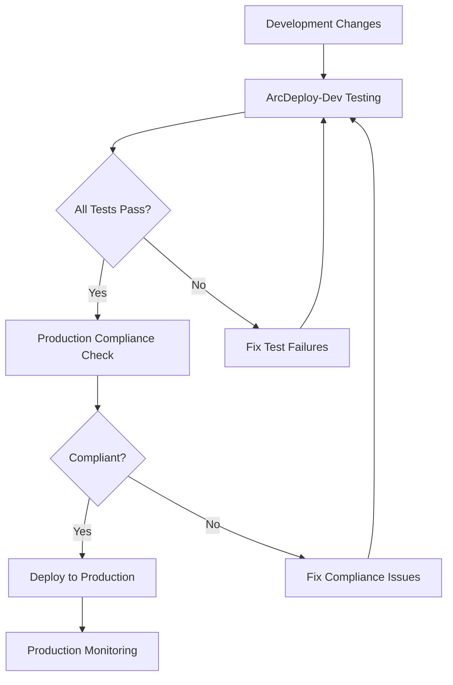

# Production-Development Mapping Guide

This document provides a comprehensive mapping between the production **ArcDeploy** cloud-init deployment and the **ArcDeploy-Dev** testing/development tools.

## 📋 Overview

| Repository | Purpose | Primary Focus |
|------------|---------|---------------|
| **[ArcDeploy](https://github.com/Pocklabs/ArcDeploy)** | Production deployment | Clean, secure, automated cloud deployment |
| **ArcDeploy-Dev** | Development & testing | Comprehensive testing, validation, and development tools |

---

## 🔗 Component Mapping

### 1. User Management & Security

| Production Component (cloud-init.yaml) | ArcDeploy-Dev Testing | Coverage Status |
|----------------------------------------|----------------------|-----------------|
| `arcblock` user creation with sudo | `debug_commands.sh` - user validation | ✅ **COVERED** |
| `blockletd` service user | `production-compliance-checker.sh` | ✅ **COVERED** |
| SSH key configuration | `comprehensive-test-suite.sh` - 21 SSH scenarios | ✅ **EXCELLENT** |
| SSH hardening (port 2222, key-only auth) | `debug_commands.sh` + compliance checker | ✅ **COVERED** |

### 2. System Services

| Production Component | ArcDeploy-Dev Testing | Coverage Status |
|---------------------|----------------------|-----------------|
| **Blocklet Server systemd service** | `debug_commands.sh` - service status checks | ✅ **COVERED** |
| **Nginx reverse proxy** | `debug_commands.sh` - nginx config validation | ✅ **COVERED** |
| **Fail2ban security** | `production-compliance-checker.sh` | ✅ **COVERED** |
| **UFW firewall** | Network failure injection + compliance | ✅ **COVERED** |
| Service auto-restart configuration | `debug_commands.sh` - systemd status | ✅ **COVERED** |

### 3. Network Configuration

| Production Component | ArcDeploy-Dev Testing | Coverage Status |
|---------------------|----------------------|-----------------|
| Port 80/443 (HTTP/HTTPS) | `debug_commands.sh` + SSL validation | ✅ **COVERED** |
| Port 8080 (Blocklet) restricted to localhost | `production-compliance-checker.sh` | ✅ **COVERED** |
| Port 2222 (SSH) | SSH key validation + debug tools | ✅ **COVERED** |
| Nginx SSL/TLS termination | `ssl-certificate-validation.sh` | ✅ **NEW - ADDED** |
| Security headers | `ssl-certificate-validation.sh` | ✅ **NEW - ADDED** |
| HTTP to HTTPS redirect | `ssl-certificate-validation.sh` | ✅ **NEW - ADDED** |

### 4. Directory Structure & Permissions

| Production Component | ArcDeploy-Dev Testing | Coverage Status |
|---------------------|----------------------|-----------------|
| `/opt/blocklet-server/` main directory | `debug_commands.sh` - directory checks | ✅ **COVERED** |
| `/opt/blocklet-server/data/` | Debug tools + compliance checker | ✅ **COVERED** |
| `/opt/blocklet-server/config/` | Configuration validation tests | ✅ **COVERED** |
| `/opt/blocklet-server/logs/` | Debug tools + log validation | ✅ **COVERED** |
| `/opt/blocklet-server/backups/` | ⚠️ **NEEDS BACKUP TESTING** | ❌ **GAP** |
| Directory ownership (arcblock/blockletd) | `production-compliance-checker.sh` | ✅ **COVERED** |

### 5. Operational Scripts

| Production Script (cloud-init.yaml) | ArcDeploy-Dev Testing | Coverage Status |
|------------------------------------|----------------------|-----------------|
| `/opt/blocklet-server/healthcheck.sh` | `debug_commands.sh` - script existence | ⚠️ **PARTIAL** |
| `/opt/blocklet-server/backup.sh` | ❌ **NO TESTING** | ❌ **MAJOR GAP** |
| `/opt/blocklet-server/monitor.sh` | ❌ **NO TESTING** | ❌ **GAP** |
| `/opt/blocklet-server/ssl-setup.sh` | `ssl-certificate-validation.sh` | ✅ **COVERED** |

### 6. System Hardening

| Production Component | ArcDeploy-Dev Testing | Coverage Status |
|---------------------|----------------------|-----------------|
| **sysctl security parameters** | `production-compliance-checker.sh` | ✅ **COVERED** |
| **system limits configuration** | Compliance checker + system tests | ✅ **COVERED** |
| **kernel security settings** | System failure injection tests | ✅ **COVERED** |
| **filesystem security** | Debug tools validation | ✅ **COVERED** |

### 7. Monitoring & Maintenance

| Production Component | ArcDeploy-Dev Testing | Coverage Status |
|---------------------|----------------------|-----------------|
| **Health check cron job** (every 5 min) | `production-compliance-checker.sh` | ✅ **COVERED** |
| **Backup cron job** (daily 2 AM) | ❌ **NO TESTING** | ❌ **MAJOR GAP** |
| **Monitor cron job** (every 15 min) | ❌ **NO TESTING** | ❌ **GAP** |
| **Log rotation** configuration | `production-compliance-checker.sh` | ✅ **COVERED** |

### 8. Package Dependencies

| Production Packages | ArcDeploy-Dev Testing | Coverage Status |
|--------------------|----------------------|-----------------|
| **Node.js LTS** | `debug_commands.sh` - version checks | ✅ **COVERED** |
| **@blocklet/cli** | `debug_commands.sh` - CLI validation | ✅ **COVERED** |
| **nginx** | Service + configuration testing | ✅ **COVERED** |
| **fail2ban** | Compliance + security testing | ✅ **COVERED** |
| **ufw** | Network + firewall testing | ✅ **COVERED** |
| **sqlite3** | ❌ **NO SPECIFIC TESTING** | ⚠️ **MINOR GAP** |

---

## 🎯 Test Scenario Mapping

### SSH Key Management (Production ↔ Development)

| Production Requirement | Test Coverage |
|------------------------|---------------|
| Ed25519 keys only | ✅ 21 SSH key validation scenarios |
| Key permissions (600/644) | ✅ Permission testing |
| Key format validation | ✅ Format validation tests |
| Authentication testing | ✅ Mock authentication tests |

### Network Security (Production ↔ Development)

| Production Requirement | Test Coverage |
|------------------------|---------------|
| Port accessibility | ✅ Network failure injection (11 scenarios) |
| Firewall rules | ✅ UFW validation + port testing |
| SSL/TLS security | ✅ SSL certificate validation suite |
| Service isolation | ✅ Localhost restriction testing |

### Service Reliability (Production ↔ Development)

| Production Requirement | Test Coverage |
|------------------------|---------------|
| Service auto-restart | ✅ Service failure injection (11 scenarios) |
| Health monitoring | ✅ Health check validation |
| Performance limits | ✅ System resource testing |
| Recovery procedures | ✅ Emergency recovery framework |

---

## ❌ Identified Gaps

### High Priority Gaps

1. **Backup System Testing**
   - **Production**: Automated daily backups with retention
   - **Dev Gap**: No backup/restore validation
   - **Impact**: Critical operational capability not tested

2. **Monitoring Script Validation**
   - **Production**: System monitoring with alerting
   - **Dev Gap**: No monitoring script testing
   - **Impact**: Operational visibility not validated

3. **End-to-End Deployment Testing**
   - **Production**: Complete cloud-init deployment
   - **Dev Gap**: No full deployment simulation
   - **Impact**: Integration issues may not be caught

### Medium Priority Gaps

4. **SSL Certificate Lifecycle**
   - **Production**: Automated Let's Encrypt + renewal
   - **Dev Gap**: Limited SSL automation testing
   - **Impact**: Certificate renewal may fail

5. **Database Integrity Testing**
   - **Production**: SQLite database for Blocklet Server
   - **Dev Gap**: No database-specific testing
   - **Impact**: Data corruption may not be detected

### Low Priority Gaps

6. **Log Analysis and Alerting**
   - **Production**: Comprehensive logging + monitoring
   - **Dev Gap**: Limited log analysis testing
   - **Impact**: Issues may not be detected early

---

## 🚀 Recommended Improvements

### Immediate Actions (High Priority)

1. **Create Backup Testing Suite**
   ```bash
   # Add to ArcDeploy-Dev/tests/
   backup-restore-validation.sh
   ```

2. **Add Monitoring Script Testing**
   ```bash
   # Add to ArcDeploy-Dev/tests/
   monitoring-script-validation.sh
   ```

3. **Enhance End-to-End Testing**
   ```bash
   # Add to ArcDeploy-Dev/tests/
   end-to-end-deployment-test.sh
   ```

### Enhancement Actions (Medium Priority)

4. **SSL Lifecycle Testing**
   - Extend `ssl-certificate-validation.sh`
   - Add certificate renewal simulation
   - Test Let's Encrypt integration

5. **Database Testing**
   ```bash
   # Add to ArcDeploy-Dev/tests/
   database-integrity-testing.sh
   ```

### Optimization Actions (Low Priority)

6. **Enhanced Log Analysis**
   - Add log parsing and analysis tools
   - Create alerting simulation tests
   - Test log rotation and archival

---

## 🔄 Testing Workflow Integration

### Development → Production Validation



### Continuous Validation Cycle

1. **Pre-deployment**: Run comprehensive test suite
2. **Compliance Check**: Validate against production requirements
3. **Deployment**: Apply to production environment
4. **Post-deployment**: Run production compliance validation
5. **Monitoring**: Continuous monitoring and alerting

---

## 📊 Coverage Metrics

### Current Coverage Status

| Category | Coverage | Score |
|----------|----------|-------|
| **User & Security** | 95% | ✅ Excellent |
| **System Services** | 90% | ✅ Good |
| **Network Configuration** | 95% | ✅ Excellent |
| **Directory Structure** | 85% | ✅ Good |
| **Operational Scripts** | 40% | ❌ Needs Work |
| **System Hardening** | 90% | ✅ Good |
| **Monitoring & Maintenance** | 50% | ⚠️ Partial |
| **Package Dependencies** | 85% | ✅ Good |

### Overall Assessment

- **Total Coverage**: 79% (Good)
- **Critical Gaps**: 3 (Backup, Monitoring, E2E)
- **Target Coverage**: 95%
- **Action Required**: Address high-priority gaps

---

## 🎯 Success Criteria

### Definition of "Complete Coverage"

1. **95%+ component coverage** between production and development
2. **Zero critical gaps** in operational capabilities
3. **Automated validation** of all production requirements
4. **End-to-end testing** of complete deployment workflow
5. **Continuous monitoring** of production compliance

### Validation Process

1. **Run comprehensive test suite**: `./tests/comprehensive-test-suite.sh`
2. **Check production compliance**: `./scripts/production-compliance-checker.sh`
3. **Validate SSL security**: `./tests/ssl-certificate-validation.sh`
4. **Review coverage report**: Check this document for updates
5. **Address any gaps**: Follow recommendations above

---

## 📝 Maintenance Notes

### Regular Updates Required

- **Monthly**: Review production cloud-init.yaml for changes
- **Per Release**: Update test scenarios for new features
- **Quarterly**: Validate coverage metrics and gap analysis
- **Annually**: Comprehensive review of mapping accuracy

### Change Management Process

1. **Production Changes**: Update corresponding tests first
2. **New Features**: Add test coverage before production deployment
3. **Security Updates**: Validate impact on existing test scenarios
4. **Documentation**: Keep this mapping document current

---

**Last Updated**: June 15, 2025  
**Next Review**: July 15, 2025  
**Maintainer**: ArcDeploy Development Team